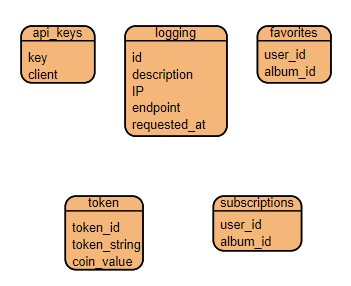

# KBLMovie.
Tugas Besar 2 IF3110 Web Based Development
 

## Table of Contents
* [General Info](#general-information)
* [Skema Basis Data](#skema-basis-data)
* [Endpoint API](#endpoint-api)
* [Pembagian Tugas](#pembagian-tugas)
* [Credits](#credits)

## General Information
Aplikasi yang kami buat adalah web yang bisa digunakan untuk menonton video. Video ini dapat disimpan pada suatu album, yang dapat dicari secara manual pada daftar album yang tertampil maupun melalui search bar. Untuk menunjang aplikasi, dibuat berbagai fitur yang mendukung aplikasi. Fitur-fitur yang secara umum menggunakan SOAP (Simple Object Access Protocol) sebagai web service yang utama, yaitu fitur redeem token, fitur penambahan album sebagai favorit, serta fitur subscribe album.

## Skema Basis Data
* Schema
> 

## Endpoint API
* /webservices/subscription/subscribe
* /webservices/subscription/unsubscribe
* /webservices/subscription/verifySubscription
* /webservices/subscription/notifySubscriber
* /webservices/subscription/removeSubscriptionByAlbumId
* /webservices/token/checkToken
* /webservices/favorite/getFavorites
* /webservices/favorite/addFavorite
* /webservices/favorite/removeFavorite
* /webservices/favorite/removeFavoritesByAlbumId

## Pembagian Tugas
* Fitur Redeem Token : 13521064
* Fitur API Key : 13521108
* Fitur Subscription : 13521108
* Fitur Logging : 13521108
* Fitur Favorite : 13521049
* DB Core : 13521108, 13521049, 13521064
* Docker : 13521108

## Credits
This project is implemented by:
1. Brian Kheng (13521049)
2. Bill Clinton (13521064)
3. Michael Leon Putra Widhi (13521108)
